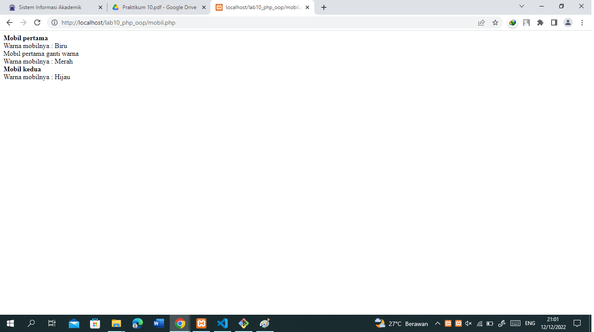
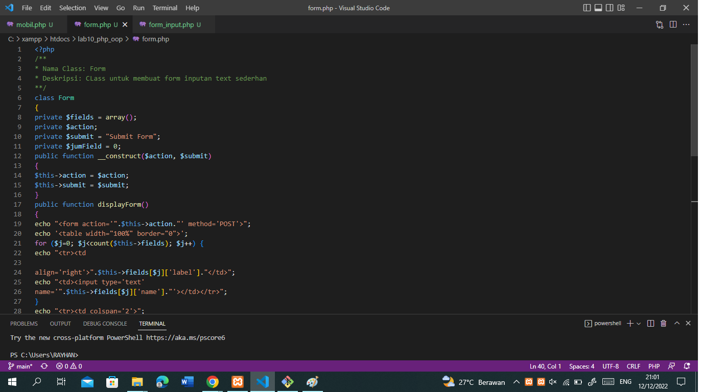
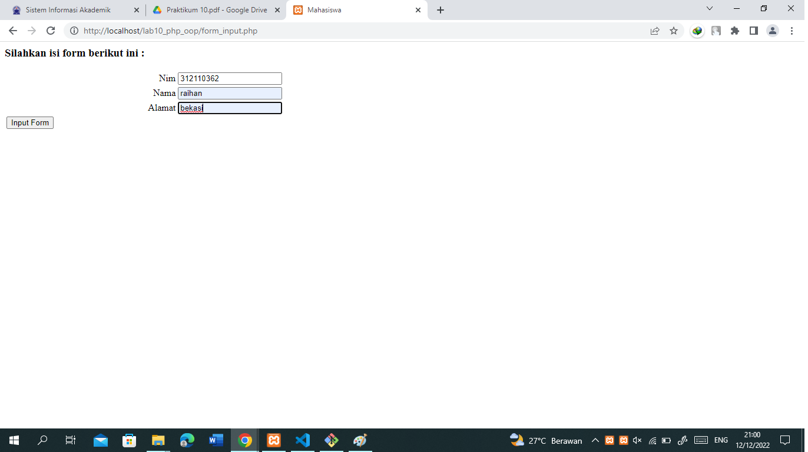

# lab10_php_oop
## PHP OOP
* Menampilkan daftar mobil sesuai dengan class yang di buat 

* Membuat Form , kerangka ini dapat digunakan dan dimodifikasi sesuai kebutuhan

* Menampilkan Form Inputan 
